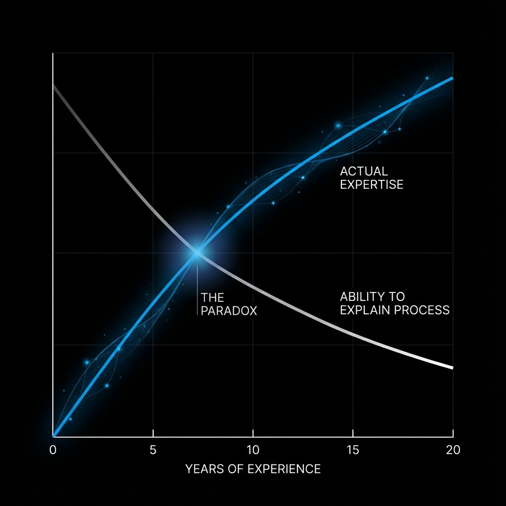

# Why Your Signature Framework Sounds Like Everyone Else's

*The problem isn't your process. It's that you can't see it.*

---

You've done the work.

You bought the course. Completed the worksheets. Sat through the "create your signature framework" workshop. You named your methodology something memorable. Maybe you even trademarked it.

And when you finally present it to a client, something's off. It sounds like everyone else's. The steps are reasonable. The logic is solid. But it doesn't capture what you *actually* do differently. It doesn't explain why clients get better results with you than with someone following the exact same "best practices."

You're not bad at frameworks. You're trying to build something you already have (you just can't see it...yet).

> **TL;DR:** Most experts try to *create* their signature framework, but your real methodology is already operating unconsciously. Framework extraction (analyzing what you actually do) beats framework architecture (deciding what you think you should do).

---

## Why "Create Your Framework" Advice Fails

There's an entire industry built on teaching experts to "create" their signature framework. The advice sounds reasonable: identify your steps, name your process, package your methodology.

This works beautifully for people early in their careers. If you've been consulting for two years, you probably need to consciously construct your approach. You're still figuring out what works.

But if you've been doing this for ten, fifteen, twenty years? The advice backfires.

The "create your framework" approach assumes your methodology is something you *decide*. You sit down, architect your steps, and choose what to include.

This approach works when your expertise lives in your conscious mind. It fails when your real methodology has gone somewhere you can't access.

---

## Where Your Real Methodology Is Hiding

Think about riding a bike.

You know how to do it. You could ride one right now. But if someone asked you to explain *exactly* how you balance (the micro-adjustments, the weight shifts, the physics happening in your nervous system) you'd struggle.

Not because you're bad at explaining things. Because the knowledge moved.

When you first learned to ride, everything was conscious. You thought about every pedal stroke. Now? You just ride. The expertise automated itself.

This is called unconscious competence. Your brain deliberately hides expertise from your conscious awareness so you can operate faster. A feature of mastery, not a flaw in your communication skills.

The problem: you can't package what you can't see.

Research suggests up to 90% of expert knowledge operates below conscious awareness. Philosopher Michael Polanyi called this "tacit knowledge," the things we know but cannot tell.

Picture an iceberg. The 10% above water? That's what you can put in a slide deck. The 90% below? That's what actually wins the deal.

When you try to "create" your framework, you're working with that visible 10%. The valuable 90%? It's running in the background, shaping every decision you make, completely invisible.

---

## The Expertise Paradox: More Skill, Less Clarity

The consultant with two years of experience can easily explain their "5-step process." They're still consciously executing each step.

The consultant with fifteen years? They stumble. They say things like "I just know" or "it depends" or "I read the room."

This stumbling is evidence of genuine expertise, not a communication failure.

The better you get, the more your methodology compresses into intuition. What used to be a checklist becomes a feeling. What used to require analysis becomes instant pattern recognition.

A doctor with thirty years of experience walks into a room and *knows* something's wrong before running a single test. Ask her how she knew? "Just... something about the presentation." Thirty years of pattern matching. No words for it.

A strategy consultant hears a CEO describe a problem and immediately knows the real issue is three layers deeper. He can't explain what signals told him. "I've just seen this pattern before." Twenty years of client meetings. No words for it.

A designer adjusts a layout by two pixels and suddenly it works. Why those two pixels? "It just felt off." Ten thousand hours of training her eye. No words for it.

This is mastery. And mastery, by its nature, becomes invisible to the master.

---

## The Difference Between Building and Discovering

**Framework Architecture** is what most courses teach. You decide what steps to include. You organize what you consciously know. You build from templates and best practices.

**Framework Extraction** is different. You analyze what you actually do. You discover patterns you can't see through introspection. You mine behavioral evidence from your real work.

Architecture creates generic frameworks because everyone's fishing in the same 10% pond. The same books sit on everyone's shelf. The same courses fill everyone's browser history. The same templates get passed around LinkedIn. No wonder everything sounds the same.

Extraction goes diving in the other 90%.

Your pattern recognition developed through your experience. Your diagnostic instincts formed through your particular client history. Your decision-making shortcuts emerged from problems only you have solved.

That's why your "architected" framework feels generic. It captures what you share with other experts, not what makes you different.

---

## 5 Signs Your Framework Was Built, Not Found

**It sounds like everyone else's.** If your framework could appear on any competitor's website without modification, it was probably architected from the same best practices everyone uses.

**You can't explain when you deviate from it.** Real expertise involves constant adaptation. If your documented framework doesn't account for the dozens of micro-decisions you make in every engagement, it's capturing the theory, not the practice.

**Clients still say "I need YOU specifically."** If your framework truly captured your methodology, others could follow it and get similar results. When clients insist on working with you personally (even after you've explained your process) they're sensing the invisible 90% that isn't in your documentation.

**You don't actually follow your own framework.** This is the tell. If you find yourself going "off script" in most engagements, your framework describes what you think you do, not what you do.

**It doesn't capture your diagnostic process.** Most frameworks describe the intervention, what you do once you've figured out the problem. But your real expertise often lives in *how you figure out the problem* in the first place. That diagnostic ability is almost always missing from the framework.

Which is exactly why extraction works differently than creation.

> **"You don't need another 'create your framework' course. You need a way to make your invisible expertise visible."**

---

## How to Extract Your Signature Methodology

The solution isn't to think harder about your process. Self-reporting fails because you can't see your own patterns.

Extraction requires behavioral evidence.

### Three Extraction Methods

**The Transcript Method:** Record your actual client conversations. Then analyze them, not for what you remember doing, but for what you actually said and asked. Look for patterns: phrases you repeat without realizing, questions you always ask in a certain order, diagnostic moves you make automatically.

**The Deviation Analysis:** Take your current "framework" and track where you deviate from it in real engagements. Those deviations aren't failures to follow your process. They're evidence of your actual process. The framework you deviate *toward* is your real methodology.

**The Replacement Test:** Imagine training a replacement. Not the high-level "here are the steps" version, but the actual "here's how to handle this specific situation." What would you tell them? When would you tell them to ignore the standard approach? Those conditional decisions ("when X, do Y instead") are your invisible expertise.

Look for patterns that appear across multiple contexts. One-offs might be flukes. But if you see the same move showing up repeatedly? That's a framework worth naming.

---

## What Changes When You See Your Real Framework

The goal isn't to create something new. It's to see what's already there.

Your methodology exists. You've been using it for years. It's produced results, built your reputation, earned client trust. The only problem is it's operating below your conscious awareness.

You don't need to architect anything new. You need to extract what's already working.

Once you can see it, everything changes. You can articulate your difference. You can teach your approach. You can scale beyond just you.

But you can't package what you can't see. And you can't see it by thinking harder.

The framework isn't missing. It's buried in the transcripts of your last ten client calls, waiting for someone to dig it out.

---

## Next Steps

**Start here:**

1. **Record your next client call.** Audio is enough. Don't change how you normally work.

2. **Listen for your automatic questions.** What do you always ask in the first 10 minutes? That's your diagnostic process revealing itself.

3. **Track one deviation.** Next time you go "off script" from your documented process, write down what you did instead. That deviation is data.

You don't need to analyze everything at once. One pattern is enough to start seeing what's been invisible.

---

## FAQ

**What is a signature framework?**

A signature framework is a proprietary methodology that captures how an expert consistently produces results. Unlike generic processes, an authentic signature framework reflects the expert's real decision-making patterns, including the unconscious expertise developed through years of experience.

**Why do signature frameworks feel generic?**

Most signature frameworks feel generic because they're "architected" (consciously designed) rather than "extracted" (discovered from actual practice). Experts who try to create their framework from scratch often default to industry-standard steps rather than capturing their unique approach.

**How long does it take to extract a signature framework?**

Most experts can identify core patterns within 3-5 analyzed client interactions. The patterns are already there — you've been using them for years. The work isn't creating something new; it's recognizing what you're already doing consistently.

**Can someone else help me extract my framework?**

Yes, and it's often more effective. You can't see your own patterns because they've become automatic. An outside observer (or AI analysis of your transcripts) can spot consistent behaviors you'd never notice through introspection alone.

**What's the difference between tacit and explicit knowledge?**

Explicit knowledge is what you can document and explain — roughly 10% of expert knowledge. Tacit knowledge is what you know but can't easily articulate — the other 90%. Your real methodology lives primarily in tacit knowledge, which is why "create your framework" approaches fail for experienced experts.

**Do I need video or is audio enough for the Transcript Method?**

Audio is enough. The patterns you're looking for are in what you say and ask, not body language. Transcripts work because they capture your actual words — the questions you ask, the phrases you repeat, the diagnostic moves you make without thinking.

---

*Ready to see what you've been using unconsciously? Start with one client call recording. Listen for the questions you ask without thinking. The patterns are already there.*
